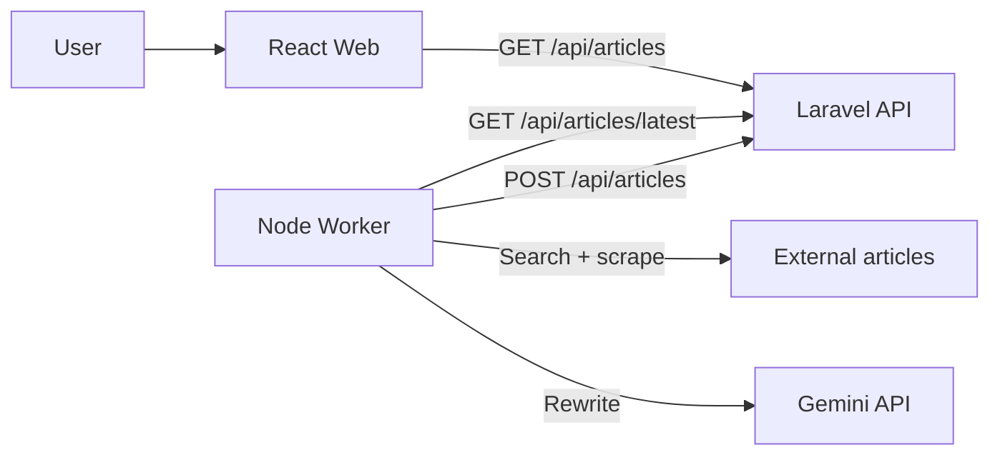

# BeyondChats

Monolithic repo containing the Laravel API, Node worker, and React frontend for the BeyondChats assignment.

## Repo Structure

- `api/` Laravel API with scraper + CRUD endpoints.
- `worker/` Node script that rewrites the latest article using Google results + Gemini, then publishes it back to the API.
- `web/` Vite React UI that displays original and updated articles.

## Local Setup

Prereqs:
- PHP 8.1+ and Composer
- Node 18+ and npm
- MySQL or Postgres

### 1) API (Laravel)

If `api/` does not include `artisan`, `public/`, `bootstrap/`, and `config/`, scaffold Laravel first and copy the custom files from this repo. See `api/README.md` for details.

```bash
cd api
composer install
cp .env.example .env
# update DB_* in .env
php artisan migrate
php artisan scrape:beyondchats
php artisan serve
```

### 2) Worker (Node)

```bash
cd worker
npm install
cp .env.example .env
# set API_BASE_URL, GEMINI_API_KEY, GEMINI_MODEL
npm start
```

### 3) Web (Vite React)

```bash
cd web
npm install
cp .env.example .env
# set VITE_API_BASE_URL to your API base URL
npm run dev
```

## Data Flow / Architecture



## Live Link

- Frontend: https://beyondchats-assign-nine.vercel.app

## Deployment Notes

- API + worker can be hosted on Render (Laravel web service + cron job).
- Frontend can be hosted on Vercel with `VITE_API_BASE_URL` pointing to the API.
